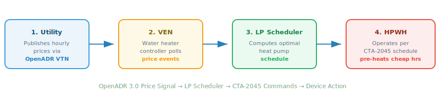
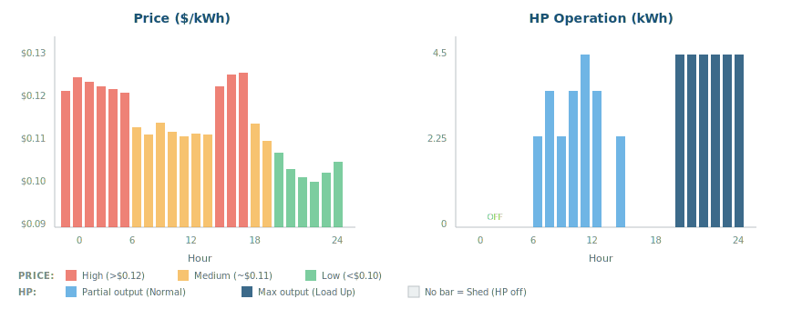
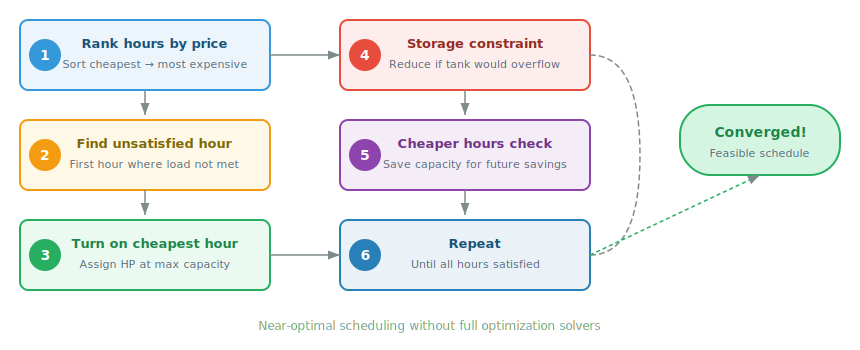
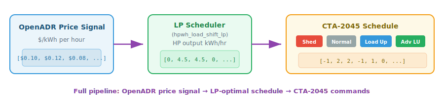

<!-- _class: lead -->
<!-- _paginate: false -->
<!-- _backgroundColor: #1a5276 -->
<!-- _color: #fff -->

# OpenADR 3.0 Demand Flexibility for Heat Pump Water Heaters

### IEA EBC Annex 96 — Activity A3

**Anand Prakash**
Carnegie Mellon University
anandkrp@andrew.cmu.edu


---

# Outline


1. **Introduction** — Motivation and goals
2. **Background** — OpenADR 3.0, demand flexibility, HPWHs
3. **Use Case** — Price-responsive HPWH control through OpenADR
4. **Software Architecture** — Components and data flow
5. **Implementation** — Easy Shift algorithm and CTA-2045 integration
6. **How to Use** — Setup, run, and extend

---

<!-- _class: lead -->
<!-- _backgroundColor: #2c3e50 -->
<!-- _color: #fff -->

# 1. Introduction

---

# Why Demand Flexibility?


- Grid decarbonization requires flexible loads that can **shift consumption**
- Water heating accounts for **~18% of residential energy use** in the US
- Heat pump water heaters (HPWHs) with storage tanks are ideal candidates:
  - Thermal storage enables **load shifting** without impacting comfort
  - Can pre-heat during cheap/clean hours, coast during expensive/dirty hours
- **Challenge:** How do we communicate price signals to devices at scale?

---

# Project Goals


Develop an **open-source software toolkit** so that researchers and practitioners can:

1. Set up an OpenADR 3.0 communication infrastructure (VTN + VEN)
2. Fetch real electricity pricing data and publish it as OpenADR events
3. Run a control algorithm that converts price signals into HPWH schedules
4. Generate CTA-2045 demand response commands for water heaters
5. Test the full pipeline end-to-end on their own machines

> All code, documentation, and quickstart notebooks are publicly available.

---

<!-- _class: lead -->
<!-- _backgroundColor: #2c3e50 -->
<!-- _color: #fff -->

# 2. Background

---

# OpenADR 3.0


**Open Automated Demand Response** — an open standard for communicating DR signals.

| Concept | Description |
|---|---|
| **VTN** (Virtual Top Node) | Server — publishes programs, events, price signals |
| **VEN** (Virtual End Node) | Client — receives signals, controls devices |
| **Program** | Defines a demand response program (e.g., dynamic pricing) |
| **Event** | Time-based signal with payload (e.g., hourly prices) |
| **Report** | Telemetry data sent from VEN back to VTN |

REST API (JSON over HTTP) with OAuth 2.0 authentication

---

# Heat Pump Water Heaters as Flexible Loads


**How HPWHs provide flexibility:**
- Tank stores thermal energy (50–80 gal)
- Heat pump COP of 3–4x vs resistance
- Can **pre-heat** during low-price hours, **coast** during high-price hours
- No comfort impact if managed well

| Parameter | Typical Value |
|---|---|
| Tank capacity | 50–80 gallons |
| HP output | 4–5 kW thermal |
| COP | 2.5–4.5 |
| Thermal storage | 8–15 kWh |

---

# CTA-2045 and Device Communication


**CTA-2045** is a modular communications interface for energy devices, providing standardized demand response commands for water heaters:

| Signal | Code | Water Heater Action |
|---|---|---|
| **Shed** | -1 | Lower setpoint, disable HP — coast on stored energy |
| **Normal** | 0 | Default operation |
| **Load Up** | 1 | Raise setpoint, pre-heat the tank |
| **Adv. Load Up** | 2 | Max setpoint, tight deadband |

This project covers the full pipeline: **OpenADR → Control Algorithm → CTA-2045**

---

<!-- _class: lead -->
<!-- _backgroundColor: #2c3e50 -->
<!-- _color: #fff -->

# 3. Use Case

---

# Price-Responsive HPWH Control Through OpenADR


**Scenario:** A utility publishes dynamic electricity prices. A water heater controller receives these prices and optimizes its operation schedule.



---

# Example: 24-Hour Price Signal and Response




**Result:** Same hot water delivered at lower cost by shifting to cheap hours.

---

<!-- _class: lead -->
<!-- _backgroundColor: #2c3e50 -->
<!-- _color: #fff -->

# 4. Software Architecture

---

# System Architecture


---

# Repository Structure


```
annex96-a3-hotwater/
├── README.md                         # Project overview
├── requirements.txt                  # Python dependencies
├── instructions.ipynb                # Setup: Python VTN
├── instructions-openleadr.ipynb      # Setup: openleadr-rs VTN
├── quickstart.ipynb                  # Demo: Python VTN
├── quickstart-openleadr.ipynb        # Demo: openleadr-rs VTN
├── controls/                         # Control algorithms
│   ├── easy_shift_public.py          # Easy Shift scheduling (independent implementation)
│   └── cta2045.py                    # CTA-2045 schedule generation
├── sample_data/                      # Example JSON payloads
└── presentation/                     # This presentation
```

---

# Two VTN Options


| | Python VTN Ref. Impl. | openleadr-rs (Rust) |
|---|---|---|
| **Language** | Python (Flask) | Rust (Axum) |
| **Database** | In-memory | PostgreSQL (Docker) |
| **Auth** | `bl_client/1001` | `any-business` |
| **Base URL** | `localhost:8080/openadr3/3.0.1` | `localhost:3000` |
| **Access** | Contact for access | Open source |
| **Best for** | Quick local testing | Production-like setup |

---

<!-- _class: lead -->
<!-- _backgroundColor: #2c3e50 -->
<!-- _color: #fff -->

# 5. Implementation

---

# Easy Shift Algorithm


**EASY-SHIFT** — Equipment Scheduling Algorithm for Thermal Energy Storage with Load Shifting
*B. Woo-Shem and P. Grant, LBNL*

**Core idea:** Rank hours by electricity cost and iteratively assign HP operation to the cheapest available hours while respecting storage constraints.

> Implementation in `easy_shift_public.py` is written independently from the public algorithm description.



---

# Easy Shift: Key Constraints


### Storage Capacity
- Tank has maximum thermal storage (e.g., 12 kWh)
- If running at full power would exceed max storage → reduce output
- Maintains a minimum reserve for unexpected demand

### Cheaper Hours Optimization
- After satisfying the current hour, check: is there a cheaper hour ahead?
- If yes, reduce current output to save capacity for the cheaper hour

### Convergence
- Returns `converged = True/False` as a flag to trigger fallback strategies

---

# CTA-2045 Schedule Generation




> Two approaches available: from Easy Shift output (uses HP output levels), or directly from prices (uses percentile thresholds).

---

# Quickstart Demo Pipeline


```python
# Step 1: Authenticate with VTN
token = get_token("bl_client", "1001")

# Step 2: Fetch prices from Olivine API
olivine_data = requests.get(OLIVINE_PRICING_URL).json()

# Step 3: Create pricing program on VTN
requests.post(f"{VTN}/programs", json=program_data, headers=auth)

# Step 4: Publish price event
requests.post(f"{VTN}/events", json=event_data, headers=auth)

# Step 5: Read events as VEN
events = requests.get(f"{VTN}/events", headers=ven_auth).json()

# Step 6: Run Easy Shift → Step 7: Generate CTA-2045 schedule
operation, converged = easy_shift(parameters)
cta_schedule = easy_shift_to_cta2045(operation, parameters)
```

---

# Example Output


```
Hourly schedule (kWh):
  Hour  0: OFF   0.00 kWh  @ $0.12052/kWh   →  Shed
  Hour  1: OFF   0.00 kWh  @ $0.12227/kWh   →  Shed
  Hour  2: OFF   0.00 kWh  @ $0.12213/kWh   →  Shed
  Hour  3:  ON   1.50 kWh  @ $0.12132/kWh   →  Normal
  ...
  Hour 19:  ON   4.50 kWh  @ $0.10689/kWh   →  Advanced Load Up
  Hour 20:  ON   4.50 kWh  @ $0.10519/kWh   →  Advanced Load Up
  Hour 21:  ON   4.50 kWh  @ $0.10300/kWh   →  Advanced Load Up

Total electricity cost: $0.62145
```

Shifts operation to cheapest hours (19–23) and generates CTA-2045 commands.

---

<!-- _class: lead -->
<!-- _backgroundColor: #2c3e50 -->
<!-- _color: #fff -->

# 6. How to Use This Software

---

# Quick Setup


### 1. Clone and install

```bash
git clone <repository-url>
cd annex96-a3-hotwater
pip install -r requirements.txt
```

### 2. Start a VTN (choose one)

**Option A: Python VTN** (contact anandkrp@andrew.cmu.edu for access)
```bash
cd openadr3-vtn-reference-implementation
virtualenv venv && source venv/bin/activate
pip install -r requirements.txt && python -m swagger_server
```

**Option B: openleadr-rs** (open source — see `instructions-openleadr.ipynb`)

---

# Run the Quickstart


### 3. Launch the notebook

```bash
jupyter notebook quickstart.ipynb           # for Python VTN
jupyter notebook quickstart-openleadr.ipynb  # for openleadr-rs
```

### 4. What the notebook does

| Step | Action |
|---|---|
| 1–2 | Connect to VTN, fetch live prices from Olivine API |
| 3–4 | Create pricing program, publish hourly price event |
| 5 | Read events as a VEN |
| 6 | Run Easy Shift and plot optimal schedule |
| 7 | Generate CTA-2045 command schedule |

---

# Extending the Software


- **Customize HPWH parameters** — Edit Step 6: tank size, HP capacity, COP, draw profile

- **Use your own price data** — Replace Olivine API with your own source

- **Add new control algorithms** — Create a new file in `controls/`

- **Integrate with CTA-2045 hardware** — Connect generated schedules to physical devices

- **Connect to a real VEN** — Replace notebook HTTP calls with a persistent VEN client

---

# Resources and References


- **Repository:** `annex96-a3-hotwater/`
- **OpenADR 3.0.1 Spec:** included in repo, or [openadr.org](https://www.openadr.org/)
- **openleadr-rs:** [github.com/OpenLEADR/openleadr-rs](https://github.com/OpenLEADR/openleadr-rs)
- **Olivine API:** `api.olivineinc.com/i/oe/pricing/signal/paced/etou-dyn`
- **Easy Shift:** B. Woo-Shem and P. Grant, "EASY-SHIFT: Equipment Scheduling Algorithm for Thermal Energy Storage with Load Shifting," LBNL. [Presentation](https://drive.google.com/file/d/1ustmh-rE7693udh-mc096bhgSyDrT89D/view)

---

<!-- _class: lead -->
<!-- _paginate: false -->
<!-- _backgroundColor: #1a5276 -->
<!-- _color: #fff -->

# Thank You

**Anand Prakash**
anandkrp@andrew.cmu.edu

IEA EBC Annex 96 — Activity A3
Carnegie Mellon University


*All source code and documentation available in the `annex96-a3-hotwater` repository*
